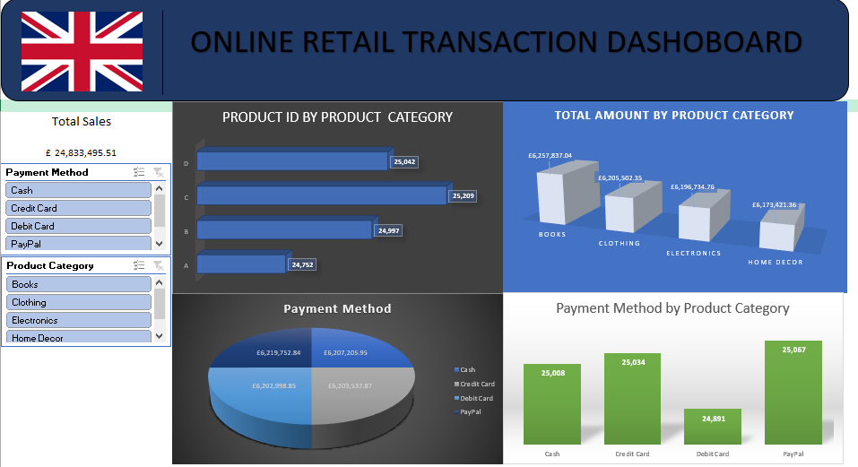

  # Project 1

**Title:** [Online Retail Transactions Interactive Dashboard](https://github.com/Ibk1cloud/Ibk1cloud.github.io/blob/main/Retail_Transaction%20Project.xlsb)

**Tools Used:** Microsoft Excel(Pivot tables, Pivot charts, Timelines, Slicers, filters)

**Project Description:** The Online Retail Transaction Dashboard provides a comprehensive analysis of retail sales performance across different product categories and payment methods. The dashboard highlights key metrics such as total revenue, transaction distribution, and customer purchasing behaviour, enabling stakeholders to identify trends, compare category performance, and evaluate payment preferences.

The total recorded sales amount to £24.83 million, indicating a substantial volume of transactions within the dataset. The dashboard integrates multiple visualisations to present insights on product category performance, revenue distribution, and payment method usage.

**Key Findings:** 
- Total revenue reached £24.83M, indicating strong business performance.
- Revenue is evenly distributed across all product categories.
- Books generate the highest revenue despite not having the highest transaction count, indicating higher average order values.
- Clothing records the highest number of transactions, reflecting high customer demand.
- Payment methods are evenly utilised, with a slight preference for PayPal, indicating a shift towards digital payments.

**Business Recommendations:**
- Focus on high-revenue categories like Books for upselling opportunities.
- Improve performance of Home Decor through targeted promotions.
- Leverage high transaction volume in Clothing to increase cross-selling.
- Enhance digital payment systems to align with customer preferences.

**Dashboard Overview:** This dashboard provides an analysis of online retail transactions, focusing on total sales, product category performance, and payment method distribution. It highlights key trends in customer purchasing behaviour and revenue generation across different product categories.

# Project 2

**Title:** [National Cancer Patient Experience Survey Dashboard](https://github.com/Ibk1cloud/Ibk1cloud.github.io/blob/main/Cancer_Patient_Survey.xlsx)

**Tools Used:** Microsoft Excel(Pivot tables, Pivot charts, Timelines, Slicers, filters)

**Project Description:** The National Cancer Patient Experience Survey Dashboard presents a comprehensive analysis of patient responses collected during Wave 1 (January–March 2010). The dataset captures key demographic and clinical variables, including age, gender, cancer stage, ethnicity, and diagnostic pathways, providing valuable insights into the characteristics of cancer patients and their interaction with healthcare services.

This analysis aims to explore patterns in patient distribution, identify demographic disparities, and evaluate the completeness and reliability of clinical data. By integrating multiple dimensions of patient information, the dashboard supports a deeper understanding of how different population groups experience cancer diagnosis and care within the healthcare system.

**Key Findings:** 
- The majority of patients fall within the 55–74 age group, confirming higher cancer prevalence among older populations.
- A significant proportion of data is missing for cancer staging, indicating major data quality issues.
- Gender distribution shows higher female representation overall, with males dominating older age groups.
- Ethnicity data is heavily skewed towards White British patients (86%), suggesting underrepresentation of minority groups.
- The dataset reveals potential disparities in healthcare access and reporting across demographic groups.

**Recommendations:**
- Improve data collection processes for cancer staging to enhance analytical accuracy.
- Focus screening and prevention programmes on high-risk age groups (55–74).
- Implement targeted strategies to improve healthcare access for underrepresented ethnic groups.
- Develop gender-specific health awareness and screening initiatives.
- Strengthen data governance and reporting standards within healthcare systems.
  
**Dashboard Overview:** The National Cancer Patient Experience Survey Dashboard provides an analytical overview of patient responses collected between January and March 2010. The dashboard explores patient demographics and clinical characteristics, including gender, age groups, cancer stage, and ethnicity, to identify patterns in patient distribution and experience.
The dashboard enables healthcare stakeholders to understand population trends, disparities, and potential inequalities in cancer diagnosis and care, supporting data-driven decision-making in improving patient outcomes and healthcare delivery.

